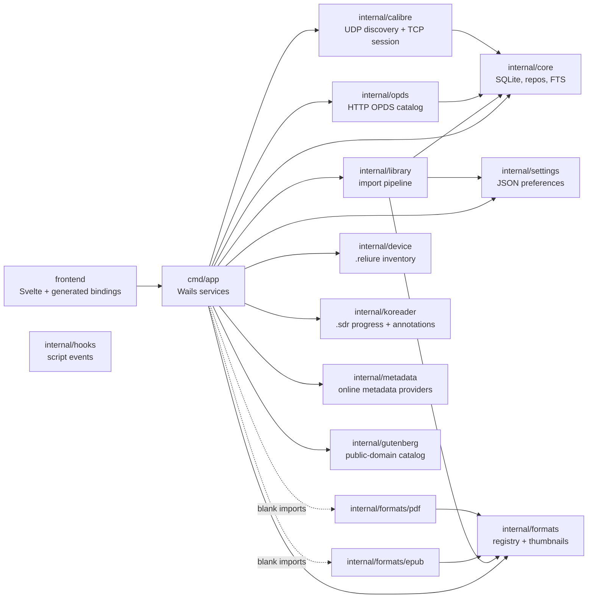
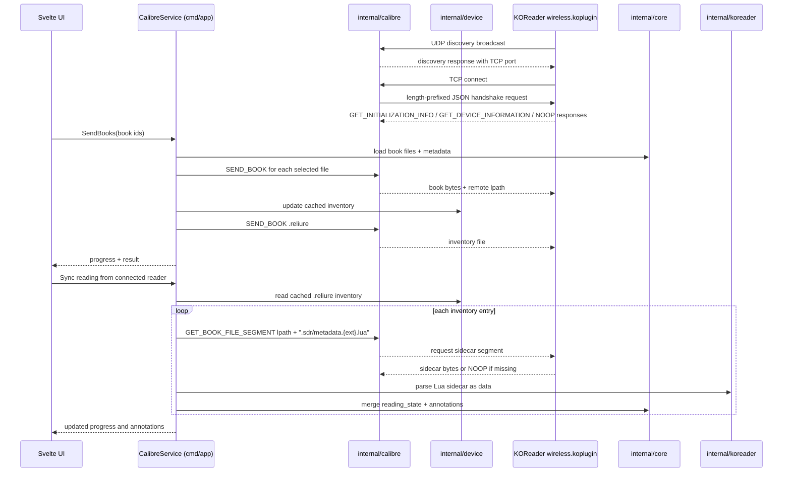

# Architecture

Reliure is a cross-platform desktop ebook library manager. The backend is 100 %
Go; the UI is a lightweight web frontend rendered in the system webview via
[Wails v3](https://v3.wails.io). See `AGENTS.md` for the session-by-session
plan and product scope.

## Guiding principle: the framework is an implementation detail

All real functionality lives in framework-agnostic packages under `internal/`.
The Wails binary is just one entry point on top of them; a future headless
`cmd/cli` (a pure OPDS server for a NAS/VPS) reuses the exact same packages.
This keeps us insulated from Wails v3's moving alpha tooling — if we ever had to
drop to v2 or another shell, `internal/` would be untouched.

```
cmd/
  app/          Wails v3 desktop entry point (thin glue)
  cli/          (later) headless / server mode
internal/
  core/         models, SQLite, migrations, repositories, full-text search
  formats/      FormatHandler interface + registry (extensibility seam)
    epub/       EPUB parser + cover/thumbnail extraction (Session 2, done)
    pdf/        PDF Info metadata parser
  library/      import pipeline: dedup, file organisation, thumbnails (Session 3, done)
  settings/     persisted user preferences (import mode, library dir, OPDS)
  opds/         OPDS pull catalog over net/http (Session 6, done)
  calibre/      Calibre "smart device" wireless protocol (Session 7, done)
  device/       per-reader `.reliure` inventories (Session 8, done)
  hooks/        user scripting on lifecycle events (Session 10)
frontend/       Svelte + Vite UI, embedded into the binary
```

## Package interaction map

The app layer wires UI-facing services to framework-agnostic packages. Most
packages do not know Wails exists; they communicate through plain Go types and
small interfaces.



## Layers

- **`internal/core`** — the heart. Owns the domain models (`Book`, `Author`,
  `Series`, `Tag`, `File`), the SQLite database, a small home-grown migration
  runner, the repositories (CRUD, listing by author/series, pagination) and
  FTS5 search. Zero dependency on Wails or the frontend. Fully unit-tested
  against an in-memory database. See `DB.md` for the data model.

- **`internal/formats`** — the extensibility seam. `FormatHandler` is the
  contract every format implements (`Format`, `CanHandle`, `Metadata`,
  `Cover`); a `Registry` dispatches a file to the first handler that accepts it.
  Handlers produce a neutral `BookMetadata` that the `library` layer maps onto
  `core` models, so parsing stays independent of storage. Adding a format is one
  new package that registers itself — the import pipeline and database stay
  unchanged. **`formats/epub`** parses container.xml → OPF → Dublin Core plus
  Calibre (`calibre:series`…) and EPUB3 (`refines`, `belongs-to-collection`)
  metadata, resolves covers through a fallback chain, and generates JPEG
  thumbnails. **`formats/pdf`** parses the standard PDF Info dictionary
  (`Title`, `Author`, `Subject`, `Keywords`, `CreationDate`) and intentionally
  does not rasterize covers yet. Handlers are tolerant: malformed or sparse
  inputs never panic and degrade to a filename title. They self-register into
  `formats.Default` via `init` (blank-import idiom).

- **`internal/library`** — the import pipeline. Detects a file's format via the
  registry, extracts metadata, deduplicates (SHA-256 for identical files; a
  title+author heuristic to attach a new format to an existing book), copies the
  file into `LibraryDir/Author/Title/`, inserts it via `core`, and caches a JPEG
  cover thumbnail. Imports run on a worker pool: parsing/hashing/cover extraction
  fan out across workers, while a **single committer goroutine** performs the DB
  writes — this keeps SQLite's lone writer happy and makes deduplication
  race-free without locks. Progress is reported per file through a callback, in
  completion order.

- **`internal/settings`** — persisted user preferences as JSON in the OS config
  dir (`settings.json`), behind a concurrency-safe `Store` with atomic writes
  and defaults. The headline preference is the **import mode**:
  - `copy` — Reliure copies imported files into a managed library tree
    (`Author/Title/`); it owns those copies.
  - `reference` — files are indexed where they already live; `file.path` points
    at the user's original and nothing is copied. Ideal for an existing
    collection the user doesn't want duplicated.
  The two are exclusive. Cover thumbnails are cached by Reliure in both modes.
  The pipeline never deletes a referenced original, only copies it made. The
  same store also persists KOReader remote-path templates and OPDS server
  preferences (`enabled`, `port`).

- **`internal/opds`** — a framework-agnostic OPDS 1.x pull catalog built on
  `net/http`. It exposes navigation feeds (root, recent books, authors, series),
  OpenSearch, acquisition entries for EPUB files (`application/epub+zip`), and
  cached cover images. The HTTP layer depends on a narrow `Catalog` interface;
  `CoreCatalog` adapts `internal/core` repositories, so the same handler can run
  in the Wails app today and in a future headless CLI later.

- **`internal/calibre`** — the Calibre wireless push protocol used by KOReader.
  Reliure answers UDP discovery, accepts the TCP session, performs the
  initialization/device-info handshake, keeps the connection alive, and sends
  files through `SEND_BOOK`. `Session.SendBook` is the book-specific helper;
  `Session.SendFile` is the lower-level primitive used for auxiliary files such
  as `.reliure`.

- **`internal/device`** — the per-reader inventory manifest. After successful
  Calibre sends, Reliure updates a versioned JSON document with local book/file
  ids, remote path, format, size, SHA-256, sent date and display metadata. The
  manifest is cached locally under the config directory and sent to the device
  as `.reliure`. On reconnect, the UI uses the cached inventory for the
  connected device to mark books as present/absent; direct remote reads of
  `.reliure` are intentionally left isolated for a later protocol extension if
  KOReader exposes a reliable file-read path.

- **`internal/metadata`** — online metadata enrichment. A `Provider` interface
  with three key-less implementations: Google Books (rich: descriptions,
  categories, covers), OpenLibrary (editions — an ISBN query uses the
  edition-precise `api/books` endpoint so the cover/ISBN match the exact edition,
  a title query uses fuzzy `search.json`), and the BnF SRU catalogue (French
  authority: correct French titles/publishers/language, no cover/ISBN). A
  `Client` fans a query out to all providers concurrently (with a descriptive
  User-Agent), merges duplicate editions (by ISBN-13 or title+author+language)
  and ranks them so the caller's preferred language surfaces first without hiding
  other editions. Results are neutral `Candidate`s (it does not import
  `internal/core`), letting the app layer offer a per-field, editable merge to
  the user. `Client.FetchImage` downloads a chosen cover for the app to thumbnail.

- **`internal/gutenberg`** — Project Gutenberg discovery off the official
  catalogue CSV (~21 MB, ~90k rows), downloaded once and cached under the config
  dir (refreshed after a month). A `Catalog` parses it into memory and searches
  there — instant, offline, with real language filtering — deliberately avoiding
  the Gutendex proxy, whose uncached queries take tens of seconds. Cover and EPUB
  URLs follow Gutenberg's fixed naming convention (no per-book API call), and
  `Download` streams the EPUB, trying the URL variants in order. Independent of
  `internal/core`/`internal/library`; the app layer downloads the EPUB to a temp
  file and feeds it to the normal import pipeline (forced copy mode).

- **`internal/koreader`** — reads KOReader's per-book `.sdr` sidecars
  (`metadata.<ext>.lua`) to recover reading progress, status and annotations
  (highlights + notes). The sidecar is a Lua `return { ... }` table, evaluated
  with a sandboxed `gopher-lua` state — no standard library is opened and a
  deadline guards evaluation, so a sidecar is treated as pure data, never code.
  Both the modern unified `annotations` array and the legacy
  `highlight`/`bookmarks` layout are understood. `Scan` walks a folder (USB /
  synced copy); `Parse` handles bytes fetched over the wire. The app layer
  matches each sidecar to a library book.

  Sidecars can also be read **over the live Calibre WiFi connection** — no USB.
  KOReader's plugin implements `GET_BOOK_FILE_SEGMENT` and resolves the requested
  `lpath` by plain concatenation under its inbox (no book-DB lookup), so
  `Session.GetFile` reads any file — including a book's `.sdr/metadata.<ext>.lua`.
  `CalibreService.SyncReadingFromDevice` walks the `.reliure` inventory (which
  maps each `lpath` → book id, giving exact matching), fetches each sidecar and
  stores progress + annotations. Missing files reply NOOP, so it never blocks.
  Device sync is **one-directional**: `ReadingRepo.MergeDeviceState` only advances
  Reliure's progress (comparing an effective percent where "complete" = 1), never
  rolls back a status the user set by hand — and Reliure never writes to the
  device. Reading status/progress can also be set **manually**
  (`LibraryService.SetReadingState`, by percentage or page), so the tracking works
  with no reader connected at all.

## KOReader / Calibre Wireless Protocol

Reliure implements the Calibre "smart device" protocol subset used by KOReader's
wireless plugin. The protocol gives us two workflows over the same live
connection: push books to the reader, then later fetch KOReader sidecars to
mirror reading state.



Important details:

- Discovery is UDP; the session itself is TCP with length-prefixed JSON
  messages.
- Reliure implements only the opcodes needed for this workflow:
  initialization/device-info, keepalive, `SEND_BOOK`, and file segment reads for
  KOReader sidecars.
- Remote paths are computed before sending from the global KOReader path
  template or a per-book override.
- `.reliure` is sent as an ordinary file through the same `SEND_BOOK` path. It
  maps each remote `lpath` back to Reliure's local book/file ids.
- Reading sync is read-only. Reliure fetches `.sdr` sidecars, parses them, and
  merges progress forward; it never writes reading state back to KOReader.

- **`cmd/app`** — the desktop shell. Creates the Wails application, registers Go
  *services* whose public methods are callable from JS, and opens the main
  window. It stays deliberately thin: it wires `internal/*` to the UI and holds
  no business logic. `App` exposes a `Ping()` health check; `LibraryService`
  wraps the importer and the catalog. Import: `ChooseAndImport()` opens a native
  picker (multiple EPUB/PDF files and/or folders); `ImportPaths()` handles a mix of
  files and directories and is also the target of window drag-and-drop — both
  build an importer from the *current* settings (so a mode change takes effect at
  once) and forward progress as `import:progress` / `import:done` events.
  Catalog: `Books`/`Search`/`BooksBy{Author,Series,Tag}` return `BookCard`s,
  `Authors`/`SeriesList`/`Tags` feed the sidebar with counts, `Book` returns the
  detail. `QuickEditRows`/`SaveQuickEdits` power the spreadsheet-like bulk
  metadata editor and deliberately reuse the normal `UpdateBook` path, so file
  moves, metadata mirroring and validation stay consistent. `SearchOnlineMetadata`
  queries `internal/metadata` for candidate editions and `ApplyOnlineMetadata`
  applies the user's field-by-field choices (again through `UpdateBook`) plus an
  optional downloaded cover. `SearchGutenberg`/`ImportGutenbergBook` back the
  "Découvrir" view: browse Project Gutenberg and add a book's EPUB (downloaded to
  a temp file, then run through the shared import core in copy mode).
  `KOReaderService` mirrors reading progress and annotations from a KOReader
  library folder (`ChooseFolderAndSync`/`Sync`): it scans `.sdr` sidecars via
  `internal/koreader`, matches each to a book (title+author, then file basename,
  then a unique title), and upserts `reading_state` + `annotation`;
  `ReadingStates` feeds the grid's progress bars and annotation badges.
  `StatsService.Dashboard` assembles the analytics dashboard from a handful of
  aggregate queries (`internal/core/stats.go`: file size/format/language counts,
  additions per month) plus reading breakdown and the device inventory; the
  frontend renders it with dependency-free SVG/CSS charts (single-hue magnitude
  bars + a labelled reading status bar). `SettingsService`
  reads/writes preferences. `OPDSService` starts, stops and reports the local
  pull catalog URL. `CalibreService` controls the push server, sends books,
  updates/sends `.reliure`, and exposes per-book device presence states to the
  UI. Cover thumbnails are served as files by a custom asset handler
  (`/covers/…` from the cover cache), never inlined as base64.

- **`frontend`** — Svelte 5 + Vite, TypeScript. The library UI: a sidebar
  (All / Authors / Series / Tags, with counts) drives a main area that toggles
  between a cover grid and a list, with instant debounced full-text search,
  sorts, a book detail drawer, a quick-edit table, a settings modal and a
  drag-and-drop overlay. Components live in `src/lib/`; `src/lib/api.ts`
  re-exports the generated bindings under a short path. It talks to Go exclusively through the
  **generated bindings** (`frontend/bindings/…`), which give strongly-typed
  JS/TS wrappers around the bound Go methods and models. No hand-written IPC.

## Go ↔ JS data flow

```
Svelte component
  → import { App } from "…/bindings/github.com/agrison/reliure/cmd/app"
  → App.Ping()                         (typed async call)
      → Wails runtime (system webview bridge)
          → Go: (*App).Ping() returns PingResult
      ← PingResult marshalled to JS
  ← rendered in the UI
```

Bindings are regenerated by the Taskfile during every frontend/app build, so
the TS API can never drift from the Go signatures. Assets are served to the
webview by an in-process HTTP asset server backed by the embedded frontend.

### Binding generation rule

Never hand-edit `frontend/bindings/**`, never create binding files manually, and
never hardcode Wails method IDs. Wails v3 generates the stable IDs used by
`$Call.ByID(...)`; guessing them from hashes is wrong and breaks runtime calls.

After changing any exported service method or frontend-facing model, run the
project task that owns binding generation:

```
GOCACHE=/private/tmp/reliure-go-cache PATH=/Users/alex/go/bin:$PATH \
  /Users/alex/go/bin/wails3 task common:generate:bindings -f
```

For a frontend build, use the Taskfile as well:

```
GOCACHE=/private/tmp/reliure-go-cache PATH=/Users/alex/go/bin:$PATH \
  /Users/alex/go/bin/wails3 task common:build:frontend -f
```

The top-level build tasks call the same chain. If `wails3` is already on PATH,
the explicit `/Users/alex/go/bin/` prefix is optional; the important part is to
let the Taskfile run `generate:bindings` with `-clean=true -ts -i ./...`.

## Project-layout choices (deviations from the stock Wails template)

The stock `wails3 init` template puts `main.go` at the module root and builds
the root package. We keep the Wails entry under **`cmd/app`** (per the target
tree in `AGENTS.md`), which required three small, deliberate adjustments:

1. **Asset embedding lives in the `frontend` package** (`frontend/embed.go`),
   not in `main`. `go:embed` cannot reference parent directories, so the embed
   must sit at/above `frontend/dist`; `cmd/app` imports `frontend.Assets`. The
   Wails asset server locates `index.html` inside the FS automatically, so the
   embed prefix needs no stripping.
2. **The build tasks target `./cmd/app`.** The generated `go build` commands in
   `build/{darwin,linux,windows}/Taskfile.yml` and `build/Taskfile.yml` had
   `./cmd/app` appended to their `-o` output.
3. **Binding generation scans the whole module** (`./...`) instead of just the
   root, so services are found wherever they live.

The mobile (iOS/Android) scaffolding from the template was removed: the product
is desktop-only (macOS first, then Windows/Linux).

## Toolchain & build

- **Go 1.26**, **Node 22+**, **Wails CLI pinned** to `v3.0.0-alpha2.117`
  (`go install github.com/wailsapp/wails/v3/cmd/wails3@<version>`). The version
  is pinned in the CI workflow and must be bumped deliberately after reading the
  changelog — Wails v3 is alpha and its tooling moves (see `AGENTS.md`, Risk 1).
- **Task runner:** the project uses [Task](https://taskfile.dev) via the CLI's
  embedded runner (`wails3 task <name>`). Common commands:
  - `wails3 task build` — generate bindings, build the frontend, compile the app
    into `bin/reliure`.
  - `wails3 task package` — build and produce a `.app` bundle.
  - `wails3 task dev` — hot-reloading dev loop (Vite dev server + Go rebuilds).
  - `go test ./internal/...` — the framework-agnostic unit tests.
- **SQLite driver:** `modernc.org/sqlite` — pure Go, no cgo, so cross-compilation
  stays trivial. (Note: the Wails webview layer itself does use cgo on desktop.)

## CI

`.github/workflows/ci.yml` runs on macOS (`macos-14`): it runs the core tests
with `-race`, vets, installs the pinned Wails CLI, runs `wails3 doctor`, builds
the app and uploads the binary. Windows and Linux jobs wait until we can test
those webviews (`AGENTS.md`, Session 9).

## Testing strategy

- `internal/core` is covered by table-ish unit tests against an in-memory
  SQLite database (`Open(":memory:")`): migrations, CRUD, cascade deletes,
  get-or-create de-duplication, ordering, pagination, FTS search (including
  accent-insensitivity and index re-sync on update), and real file-backed
  persistence across reopen.
- Later sessions add a corpus of real (and deliberately broken) EPUBs for the
  parser — the single most valuable test investment of the project.
