<h1>
  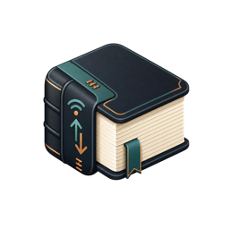
  Reliure
</h1>

Reliure is a desktop ebook library manager built for readers who use
KOReader and want a fast, clean way to organise, enrich and send books to their
device.

It focuses on the everyday workflow around a personal library: importing books,
fixing metadata, browsing covers, and moving files to the reader with the right
folder structure. It also tracks what is already on the reader, what you are
reading, and turns KOReader's reading data (progress, highlights, ratings and
statistics) into something you can actually browse.

I need it for my personal use, and my LLM friend is kind enough to help me build it,
but I thought maybe others would be interested.

## Downloads

Prebuilt releases are available from the
[GitHub Releases page](https://github.com/agrison/reliure/releases).

- [macOS](https://github.com/agrison/reliure/releases/latest/download/reliure-macos-arm64.zip)
- [Windows](https://github.com/agrison/reliure/releases/latest/download/reliure-windows-amd64.zip)
- [Linux amd64](https://github.com/agrison/reliure/releases/latest/download/reliure-linux-amd64.zip)

## Screenshots

| Feature | Screenshot |
| --- | --- |
| Library | 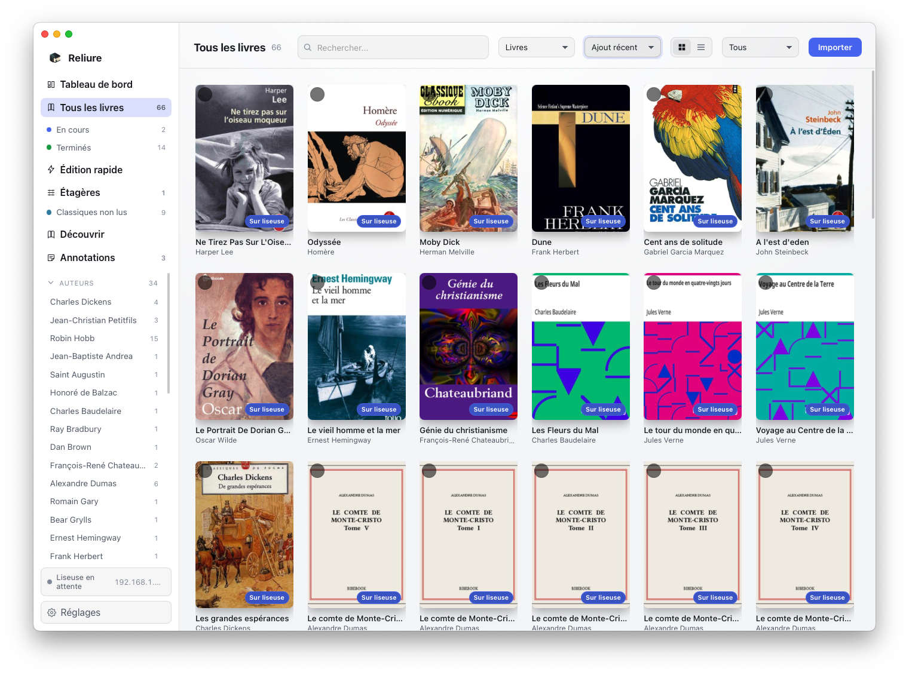 |
| Library (as list) | 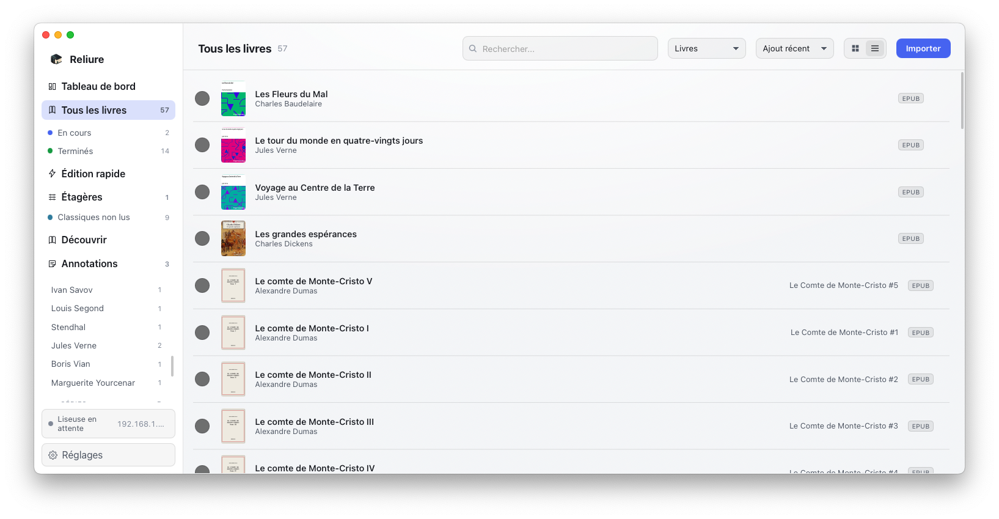 |
| Currently reading | 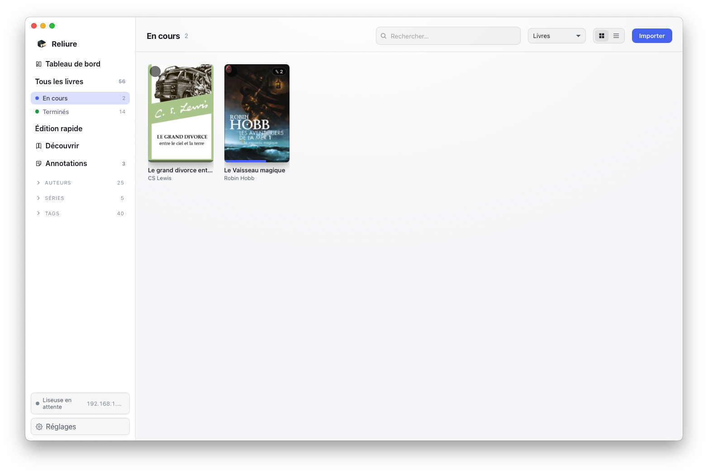 |
| Dashboard | 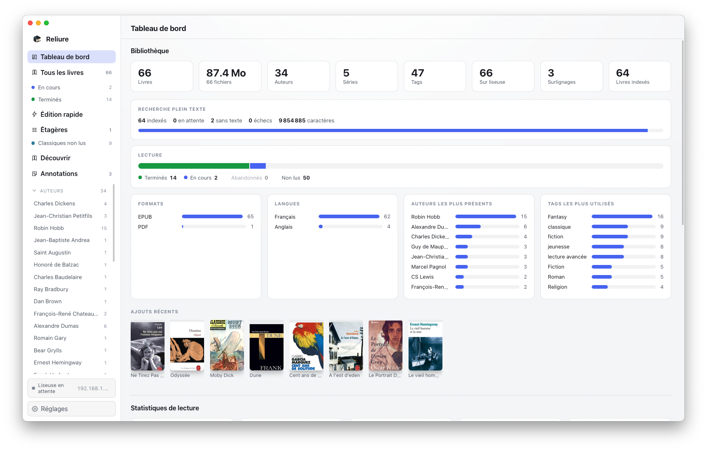 |
| Reading statistics (from KOReader) | 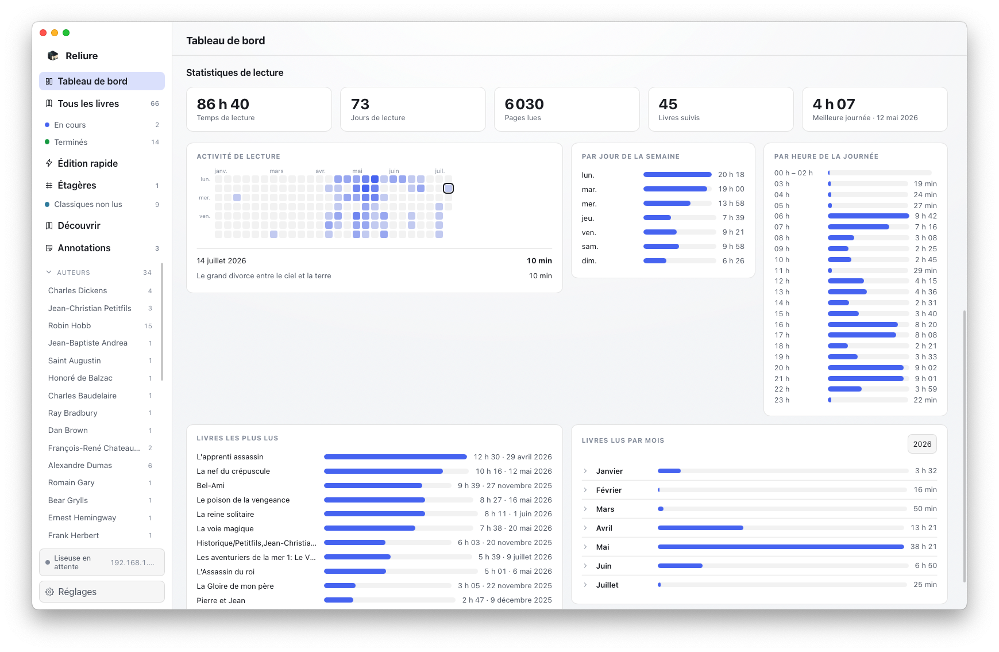 |
| KOReader currently reading sync | 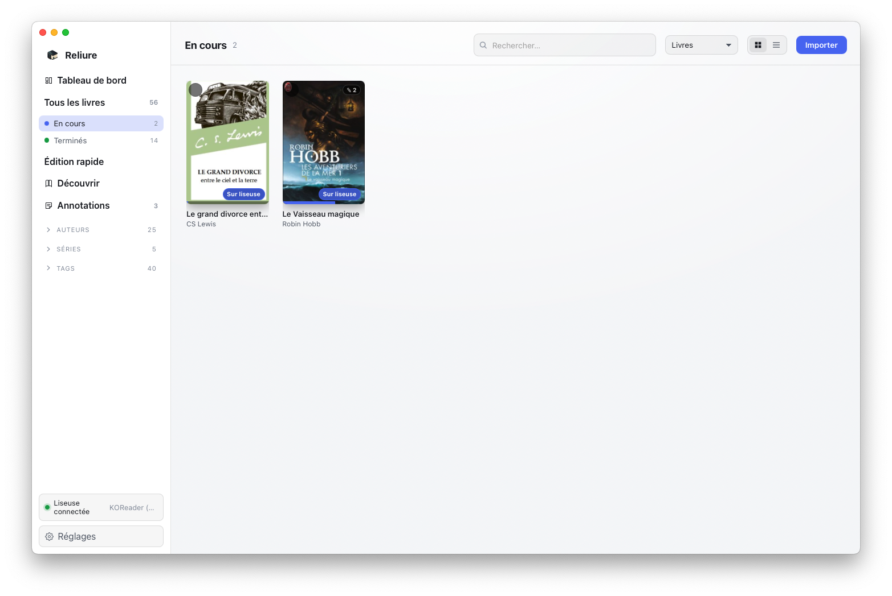 |
| KOReader reading details | 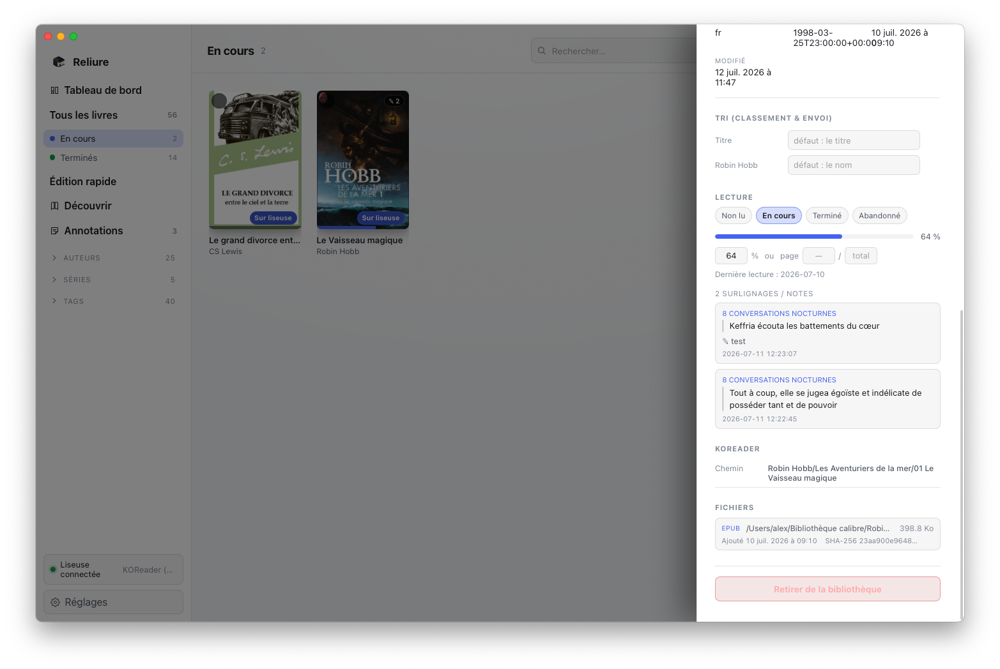 |
| Discover | 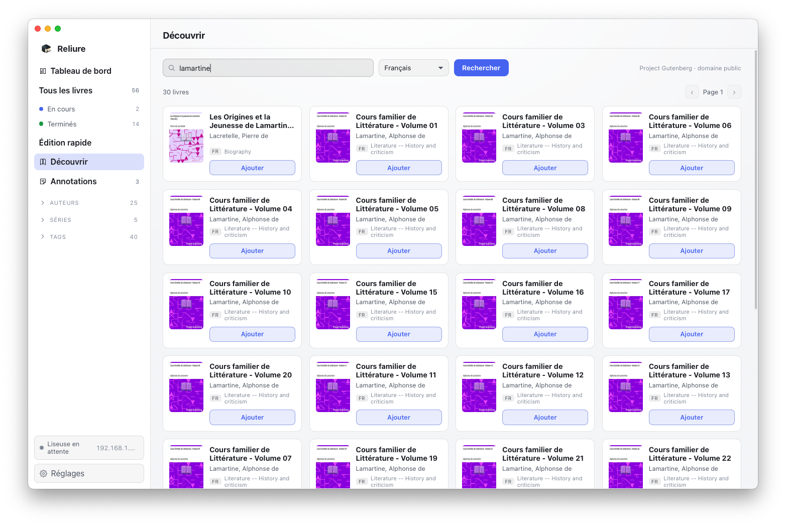 |
| Dynamic shelves | 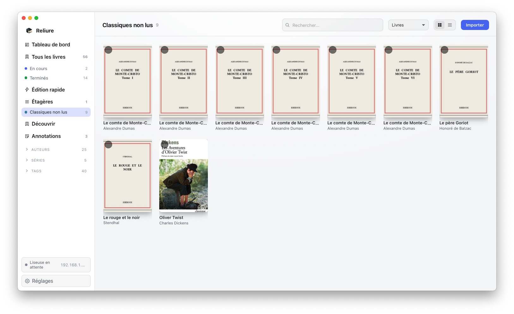 |
| Full-text search | 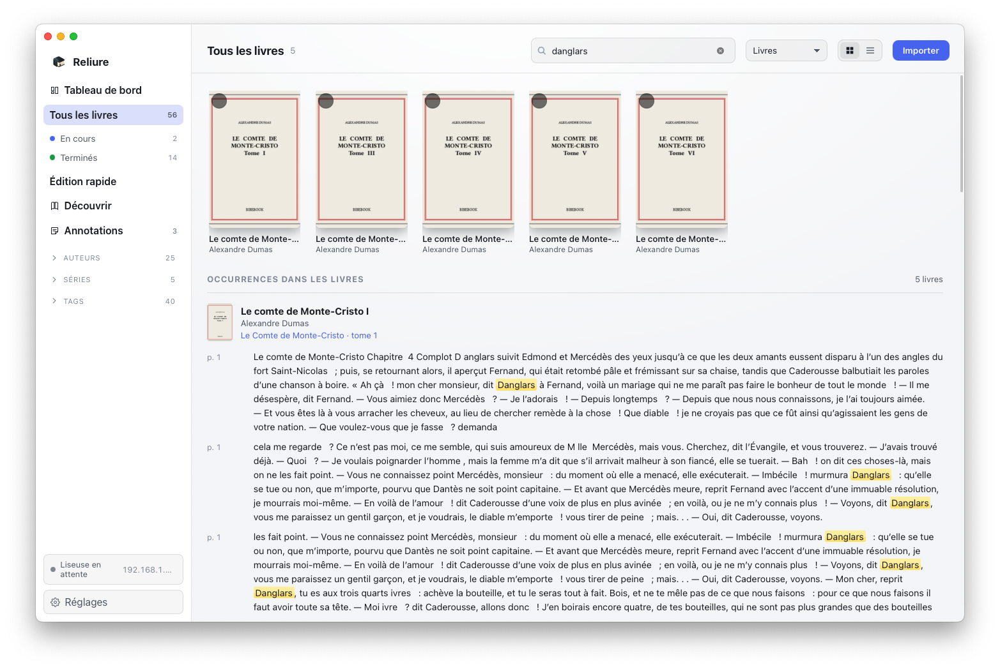 |
| Full-text search results | 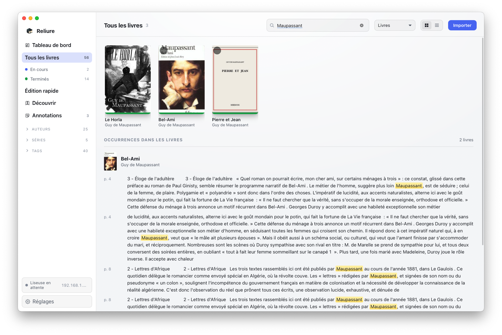 |
| Full-text search in dark mode | 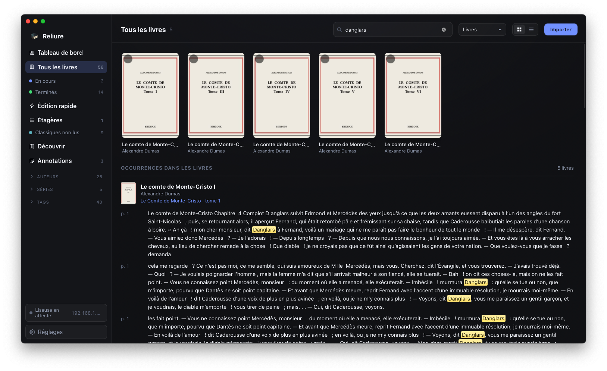 |
| Internationalized interface | 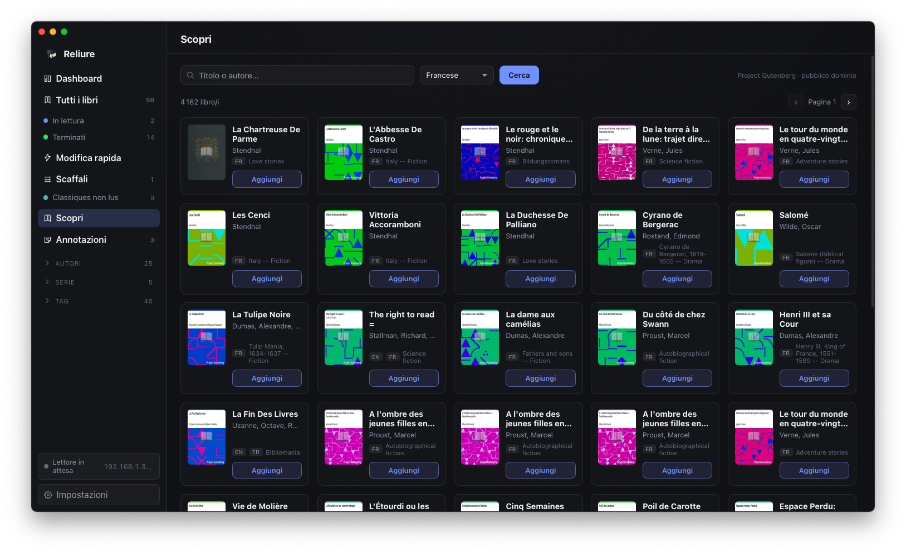 |

## Library And Organisation

- Builds a local ebook library from files or folders.
- Imports books by copying them into a managed library, or by referencing files
  where they already are.
- Automatically imports new books dropped into a **watched folder**.
- Extracts metadata, authors, series, tags, language, identifiers and covers,
  with deduplication (same file, or same title/author across formats).
- Shows the library as a cover grid, list, author view, series view or tag view.
- **Dynamic shelves**: rule-based collections that populate themselves (by tag,
  language, series, reading status, presence on the reader…).
- **Reading-status filters** in the sidebar: In progress, Finished, Abandoned.
- **Annotations view** that groups every highlight and note by book.
- Lets you edit metadata book by book or quickly in a spreadsheet-like table,
  including batch edits.
- Generates and regenerates cover thumbnails.

## Reading Tracking And Ratings

- Mark books as **reading, finished, abandoned or unread**, entirely inside
  Reliure — no reader required.
- Set progress by **percentage or page**, and rate books from **1 to 5 stars**.
- Progress bars, "read" and "on reader" chips appear right on the grid and list.
- When you sync from KOReader, progress only ever moves **forward**, and a rating
  or status you set by hand is never overwritten by the device.

## Reading Statistics (from KOReader)

When enabled, Reliure reads KOReader's statistics database and turns it into a
dashboard:

- Total reading time, days read, pages read and your best day.
- Reading time **by weekday** and **by hour of the day**.
- A **calendar heatmap** of daily activity — click any day to see the books read
  that day and for how long.
- Your **most-read books**, and a **month-by-month timeline** (pick the year,
  expand a month to see the time spent on each book).
- Fetched over WiFi through the Calibre connection (no cable), **automatically
  when the reader connects**, and cached so it stays visible offline.

## Analytics Dashboard

A dashboard summarises the whole library: counts of books, authors, series and
tags, total size on disk, a reading-status breakdown, and distributions by
format, language, top authors and additions per month.

## KOReader Integration

Reliure is designed to be a good companion app for KOReader.

- Send selected books wirelessly through the **Calibre wireless protocol**, with
  the exact destination folder you configure (a path template with variables, or
  a per-book override).
- Expose the library as an **OPDS catalog** for pull-based downloads.
- Keep a `.reliure` inventory on the reader so the app knows which books are
  already there — shown as an **on-reader chip** and a **library filter** (show
  only books on / not on the reader) to make transfers easy. This presence stays
  visible **even after the reader disconnects** (cached, refreshed on reconnect).
- Sync **reading progress, annotations and star ratings** from KOReader, either
  over WiFi (Reliure reads the `.sdr` sidecars directly through the Calibre
  connection) or from a folder (a mounted device or a synced copy).
- Optionally write edited metadata back into the EPUB so KOReader shows it too.

## Search

- Fast, instant search across titles, authors, series and tags.
- Optional **full-text search inside book contents**: Reliure indexes the text of
  your ebooks so you can find a book by a phrase it contains, with an occurrences
  view showing where the phrase appears.

## Metadata And Discovery

Reliure includes tools to improve and complete messy libraries:

- Online metadata lookup from **Google Books, OpenLibrary and the BnF** catalog.
- Editions shown side by side, ranked by your preferred language, with a
  **per-field merge** so you choose exactly what to keep or replace (including an
  author-name flip and cover replacement from online results).
- Discover and import public domain books from [Project Gutenberg](https://www.gutenberg.org/)
  and [Standard Ebooks](https://standardebooks.org/) directly inside the app.

## Interface

- Light and dark themes that follow the OS or a manual choice.
- Available in **English, French, German, Spanish and Italian**.

## Supported Formats

Reliure currently focuses on EPUB and PDF, with an extensible format system for
future additions.

Current support includes:

- EPUB, EPUB 3 and common EPUB-derived extensions such as `.epub.images`,
  `.epub.noimages`, `.epub3.images`, `.kepub` and `.kepub.epub`.
- PDF metadata import.
- Cover thumbnails from common image formats including JPEG, PNG, GIF and WebP.

## Current State

Reliure is actively developed and already covers the core library and KOReader
workflow. It is not positioned as a Calibre clone; the goal is a lighter,
modern desktop app with strong KOReader integration.

Some areas are still evolving, especially packaging, cross-platform polish and
future format support.

## Built With

Reliure is a desktop app with:

- Go for the backend and library logic.
- SQLite for local storage.
- Svelte for the interface.
- Wails v3 for the native desktop shell.

Developer-focused documentation lives separately:

- [ARCH.md](ARCH.md) for architecture.
- [DB.md](DB.md) for the database model.

## Building From Source

On macOS, the app bundle can be built with:

```bash
env PATH=/Users/alex/go/bin:$PATH GOCACHE=/private/tmp/reliure-go-cache /Users/alex/go/bin/wails3 task package -f
```

The generated app is:

```text
bin/reliure.app
```
